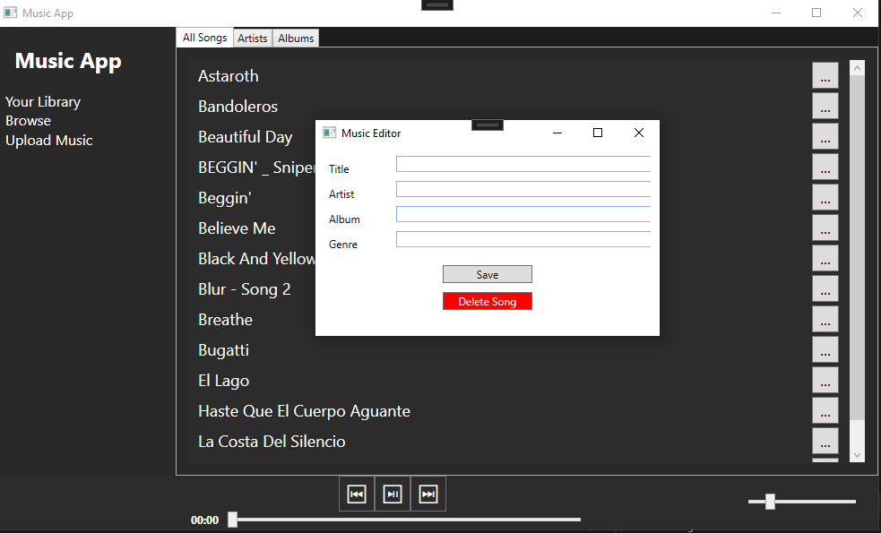

# WPF Music Player

A feature-rich music player application built using WPF (Windows Presentation Foundation) in C#. This project allows users to upload MP3 files from their computer, browse and download music from YouTube, and manage their music library with filtering and manual editing capabilities.

## Features

- **Upload MP3 Files**: Add MP3 files from your local computer to the music player.
- **YouTube Integration**: Browse and download music directly from YouTube. Downloaded tracks are saved locally.
- **Music Library Management**: Filter music by artist and album.
- **Edit Song Properties**: Manually edit the properties of songs, such as title, artist, and album.

## Screenshots

